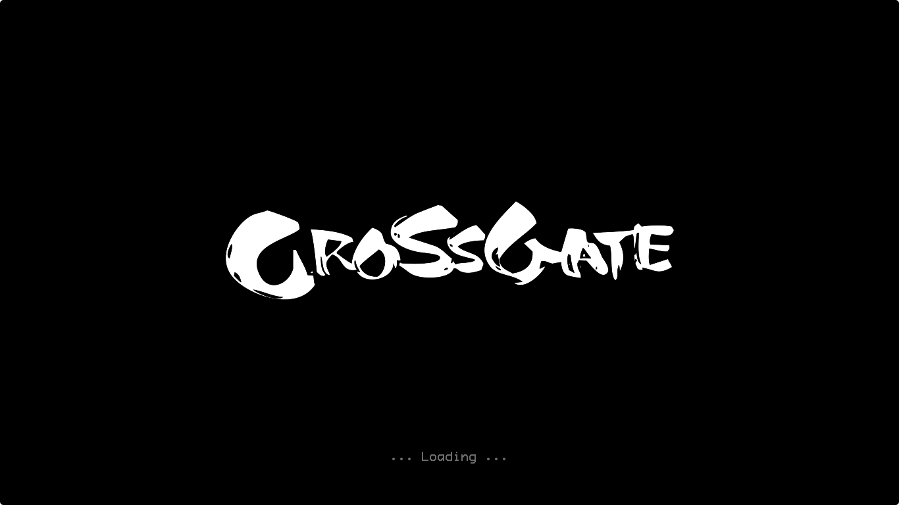
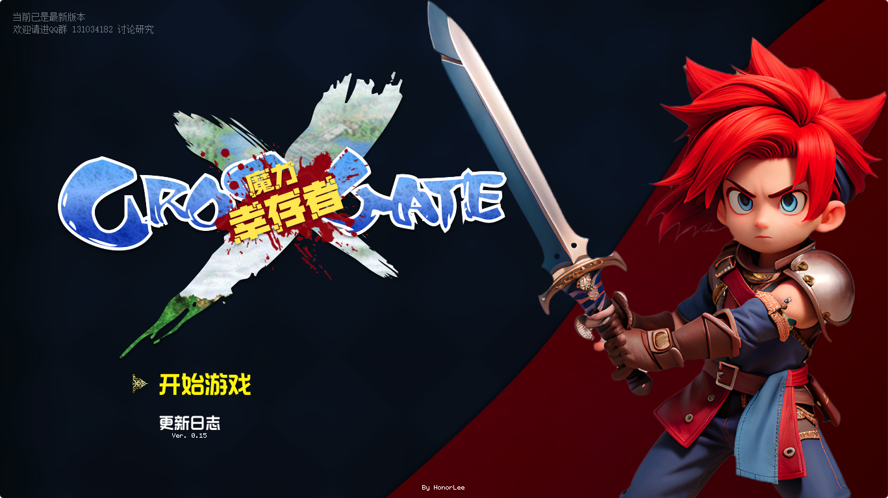
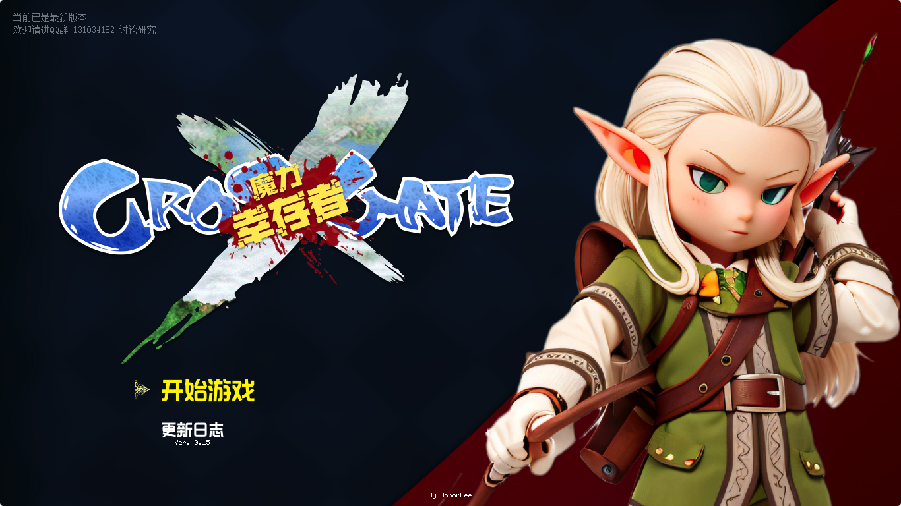
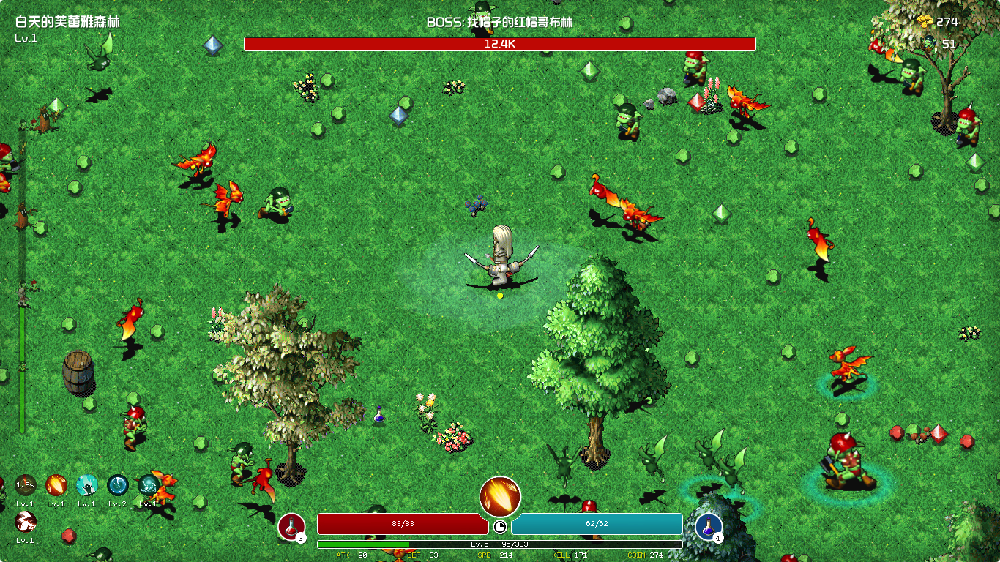

# Crossgate Survivors 魔力宝贝幸存者
## Unity C# 项目源码 (Unity开发版本 2021.3.30f1)

## 1、开源目的
本脚本旨在学习研究```Crossgate``` ```魔力宝贝``` 图档bin文件的解压与使用，和幸存者游戏模式的学习制作

相关资料来源于互联网文章与相关技术大佬指导

再次感谢```阿伍```等在互联网上分享相关解压、算法解析等教学文章的技术大佬所提供的帮助

本脚本遵照GPL共享协议，可随意修改、调整代码学习使用

请务删除或修改文档或源代码中相关版权声明信息，且严禁用于商业项目

因利用本脚本盈利或其他行为导致的任何商业版权纠纷，脚本作者不承担任何责任或损失

本项目使用自研图档解析库 CGTool

解析库原始发布地址: [https://git.honorlee.me/HonorLee/CGTool](https://git.honorlee.me/HonorLee/CGTool)

同步更新至Github: [https://github.com/HonorLee-cn/CGTool](https://github.com/HonorLee-cn/CGTool)

如有任何问题请至Github提交Issues或联系作者

## 2、项目说明
请自行寻找相关游戏资源文件并放于项目根目录`bin`文件夹内，本项目不提供任何游戏资源文件

请用Unity打开并选择GameScene场景调试运行









## 3、更新日志

### 计划中
掉落系统增加宝箱

做各种技能

### 2023.09.19 - 0.15
`ADD` 新的NPC-商人现已加入

```
可以购买装备提升自己了

商人默认有售卖红瓶和蓝瓶

另外售卖3件装备
```

`ADD` 顺便加入了一些无厘头的装备道具
```
装备分为 `白(1~2)、绿(3)、蓝(4)、黄(5)、紫(6)` 多个级别

装备所具备的加成属性也随之增多

生成几率为  `正常、20%、5%、%2、%1`

可以多次打开商店刷新

当然购买价格也会随之上涨

装备价格暂定为 `装备等级*100+属性数量*50`

目前暂定装备等级为 `人物等级/2`

最小为`1`级,最大`10`级
```

装备属性分别有：
> 最大生命值  +百分比
> 
> 最大魔法值  +百分比
> 
> 攻击力
> 
> 攻击力  +百分比
> 
> 防御力
> 
> 防御力  +百分比
> 
> 速度 
> 
> 速度  +百分比 
>
> 获取经验  +百分比
> 
> 获取金币  +百分比
> 
> 暴击率  +百分比

### 2023.09.17 - 0.14
`ADD` 增加了战场随机NPC

> 医生
> 
> 技能学习 

`ADD` 每分钟会自动刷新NPC,出现时可靠近并按F键进行互动


`UPD` 重构了数值框架并重新设计了数值算法

`UPD` 现在人物和怪物的各项数值相对平衡，也不缺难度

`UPD` 升级经验、数值提升相对平缓,为装备系统做准备

`UPD` 更换了人物光环技能的光环特效

### 2023.09.16 - 0.13
`ADD` 新增两个人物光环技能
> 缓速光环
> 
> 灼热光环 

`ADD` 新增关卡妨碍怪物生成(增加经验来源)
```
每分钟在地图四周或中心位置随机刷新1~2波当前关卡等级的怪物

刷新时间不受关卡影响,持续刷新

每波为固定10个已展现或特殊加入的怪物
```

`UPD` 怪物现在会躲避障碍物避免卡位

`UPD` 调整怪物刷新位置，非妨碍型怪物会避免贴脸刷出

`FIX` 修复因技能学习过滤导致得意技技能无法学习

### 2023.09.15 - 0.12
`ADD` 新增剑士人物

`ADD` 增加剑士专属技能 - 弧月斩

`ADD` 增加提高人物属性的被动技能

`ADD` 增加怪物光环能力,提高范围内怪物属性
> 力量光环	+20%伤害
> 
> 防御光环	+20%防御
> 
> 速度光环	+20%移动速度
> 
> 气血光环	+20%最大血量


`UPD` 调整关卡并增加难度

`ADD` 增加怪物轮次导航

`ADD` 增加主界面人物形象

`ADD` 增加版本自动检测

`ADD` 增加暴击效果和对应被动技能

`ADD` 开放第二幕怪物以供预先查看

`FIX` 修复升级选技能BUG

`FIX` 修复经验BUG

`FIX` 修复得意技释放BUG

各种优化


### 2023.09.14
`ADD` 完成掉落系统，目前已支持：
> 经验球
> 
> 魔石（金币）
> 
> 补血、补魔球
> 
> 血瓶、蓝瓶

`ADD` 完成普攻技能

`ADD` 怪物绑定为默认攻击技能

`ADD` 增加怪物攻击

`ADD` 完成升级与技能学习功能

`UPD` 调整之前的技能接口框架

`ADD` 补完各种UI和交互
等等等等.......

### 2023.09.13
`ADD` 战斗UI定型

`ADD` 各部分事件侦听、消息互通

`ADD` 完成伤害计算效果

`ADD` 完成各部分UI交互

`ADD` 构建掉落系统

### 2023.09.12
`UPD` 战斗UI界面持续优化

`ADD` 完成技能、道具等冷却系统
`ADD` 构建角色、怪物单位升级、属性变更等关键接口
`ADD` 构建技能接口和实现方案
`ADD` 实现远程弓箭职业技能
> 普攻
> 
> 乱射 - 得意技


### 2023.09.11
`ADD` 完成各种参数的配置结构,可通过配置项调整：
> 角色职业属性
> 
> 怪物属性
> 
> 技能属性
> 
> 关卡配置

`ADD` 完成选关界面
`UPD` 调整优化战斗界面UI

### 2023.09.10
主要框架搭建

实现地图生成、动画播放、基础UI框架

实现人物移动、转向控制等

### 2023.09.09
Crossgate-魔力宝贝 幸存者

立项

> Developed  By  Honorlee

> AKA  -  不会玩游戏的蛋哥